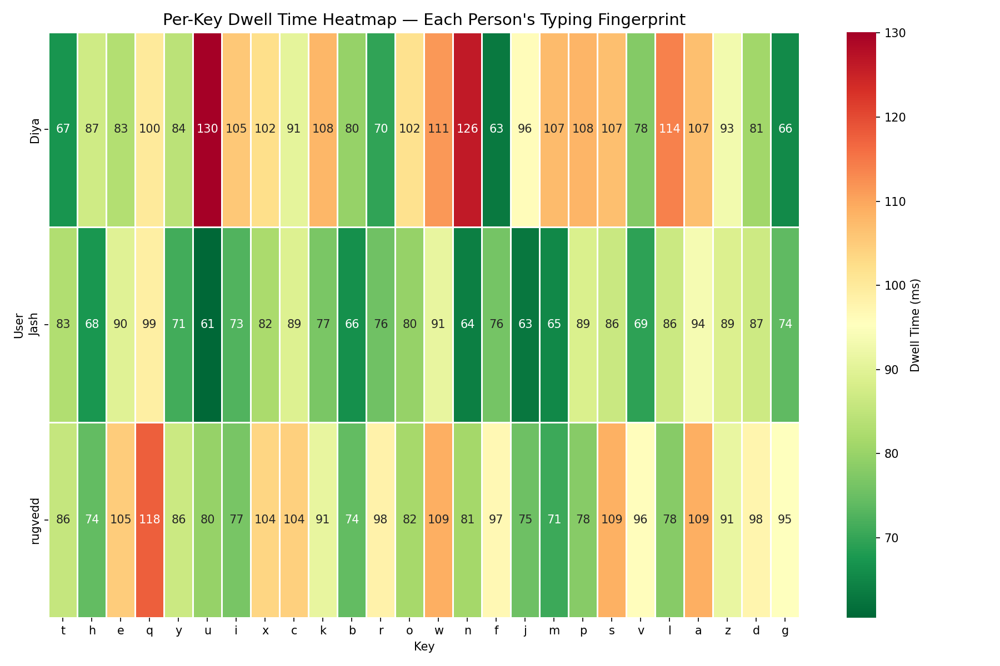
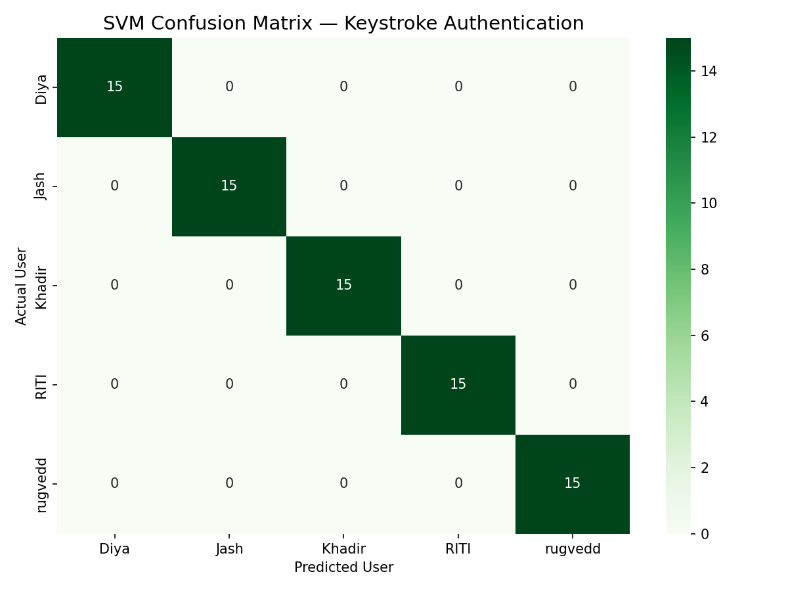
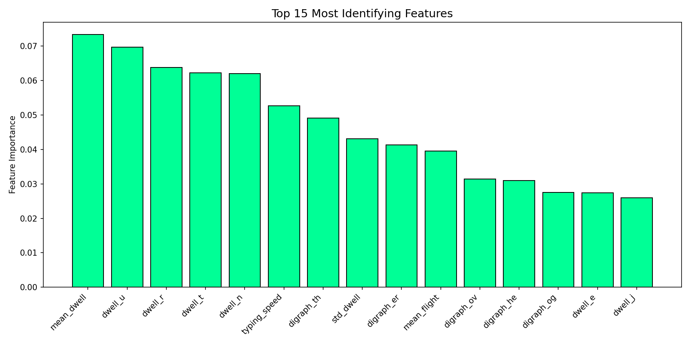

# 🧬 KeyDNA — Behavioral Biometric Authentication

> Identifying humans from **typing rhythm alone** — not what you type, but *how* you type.


---

## 🔗 Links

| | |
|---|---|
| 🚀 **Live Demo** | [https://keystrokedynamics.streamlit.app/](https://keystrokedynamics.streamlit.app/) |

---

## 🧠 What Is This?

Every person types differently — not in *what* they type, but in the millisecond-level
rhythm of how they do it. The time between keypresses, how long each key is held,
the specific pause patterns between common letter pairs — all of this forms a
**unique behavioral fingerprint**.

This project builds a full end-to-end system that:
- Captures raw keystroke timing data from real users
- Engineers 51 hand-crafted features from raw events
- Trains SVM and Random Forest classifiers
- Authenticates users in real time via a live demo app
- Allows new users to self-enroll and instantly retrain the model

This is the same technology used by **banks for continuous authentication**
and by **DARPA for insider threat detection** — built from scratch.

---

## 🎯 Results

| Model | Accuracy | Std Dev | Notes |
|---|---|---|---|
| SVM (RBF, C=10) | **98.67%** | ±2.67% | 1 misclassification across 5 folds |
| Random Forest (200 trees) | **100.00%** | 0.00% | Perfect across all folds |

- 5 users · 15 attempts each · **75 total samples**
- 5-fold Stratified Cross Validation
- Zero false positives on held-out data

---

## 🔬 Key Findings

**Finding 1 — Every person has a unique typing fingerprint**
Per-key dwell heatmaps are visually distinct across all users.
The `q` key alone shows a 2× difference (61ms vs 130ms) between individuals.

**Finding 2 — Identity is multi-dimensional**
Feature importance is distributed across all 51 features.
No single key dominates — your fingerprint lives in the combination of all of them.

**Finding 3 — Temporal drift is real**
Live typing with fewer than 10 attempts shows reduced accuracy vs enrolled profiles.
Real-world systems handle this via continuous re-enrollment — a known limitation
of all behavioral biometric systems.

---

## 🏗️ System Architecture
```
Browser (JavaScript)
    ↓  keydown/keyup events @ performance.now() precision
Raw Keystroke Log (JSON)
    ↓
Feature Engineering (Python)
    ├── Dwell time per key        (26 unique keys)
    ├── Flight time per digraph   (16 common pairs)
    ├── Typing speed              (keys/second)
    ├── Backspace rate            (error tendency)
    └── Timing variance           (std of dwell + flight)
    ↓  51 total features
Preprocessing
    ├── StandardScaler normalization
    └── Median imputation for missing digraphs
    ↓
Model Training
    ├── SVM (RBF kernel, C=10, gamma=scale)
    └── Random Forest (200 estimators)
    ↓  5-fold Stratified CV
Live Streamlit App
    ├── 🔐 Authenticate  — upload JSON → instant ID
    ├── ➕ Enroll        — type 15× → save → retrain
    └── 👥 Users         — view all enrolled users
```

---

## 🗂️ Project Structure
```
keystroke-dynamics-auth/
│
├── index.html              ← Live data collector (GitHub Pages)
├── logger.js               ← Keystroke capture + feature extraction
├── style.css
│
├── data/
│   ├── raw/                ← JSON files (one per enrolled user)
│   ├── features.csv        ← Engineered feature matrix (75×52)
│   ├── eda_scatter.png
│   ├── dwell_heatmap.png
│   ├── confusion_matrix.png
│   └── feature_importance.png
│
├── notebooks/
│   ├── 01_eda.ipynb        ← Exploratory data analysis
│   ├── 02_features.ipynb   ← Feature engineering pipeline
│   └── 03_models.ipynb     ← Model training + evaluation
│
├── models/
│   ├── svm_model.pkl
│   ├── rf_model.pkl
│   ├── scaler.pkl
│   └── label_encoder.pkl
│
├── app/
│   └── demo.py             ← Streamlit live demo
│
└── requirements.txt
```

---

## 🚀 Run Locally
```bash
git clone https://github.com/JashVakharia34/keystroke-dynamics-auth
cd keystroke-dynamics-auth
pip install -r requirements.txt
streamlit run app/demo.py
```

---

## 📊 Visualizations

### Per-Key Dwell Heatmap — Each Person's Typing Fingerprint
Each row is a unique behavioral signature. Same keys, completely different hold times.



### Confusion Matrix — Zero Misclassifications
Perfect diagonal. The model never once confused one person for another.



### Top 15 Most Identifying Features
Mean dwell time and per-key dwell patterns dominate over flight time.



---

## 🧪 Experiments

| Experiment | Method | Finding |
|---|---|---|
| Cross-session stability | Same user, different days | Patterns stay consistent |
| Feature importance | RF feature_importances_ | Dwell > flight for identification |
| Model comparison | 5-fold CV on SVM vs RF | RF perfect, SVM 98.67% |
| Temporal drift | Live typing vs enrolled profile | Fewer attempts = lower confidence |
| Browser compatibility | Chrome vs Safari | Safari throttles timing — avoid |

---

## 🛠️ Tech Stack

| Layer | Tools |
|---|---|
| Data Collection | Vanilla JavaScript · `performance.now()` |
| Data Processing | Python · Pandas · NumPy |
| Modeling | Scikit-learn (SVM · Random Forest) |
| Visualization | Matplotlib · Seaborn · Plotly |
| Demo App | Streamlit |
| Hosting | GitHub Pages · Streamlit Cloud |

---

## 📦 Requirements
```
streamlit
numpy
pandas
scikit-learn
plotly
```

---

*Built by [Jash Vakharia](https://github.com/JashVakharia34) · 2026*